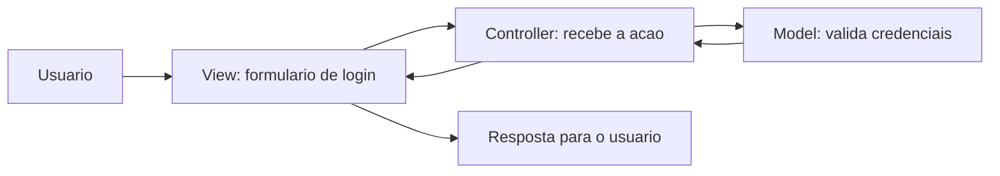

# Conceito de MVC

MVC é um padrão de organização para aplicações web.

A ideia central é separar responsabilidades para facilitar manutenção, testes e evolução do sistema.

## Objetivos da unidade

- Entender o papel de Model, View e Controller.
- Diferenciar responsabilidades usando analogias simples.
- Visualizar o fluxo de login em uma aplicação MVC.
- Identificar componentes de MVC em funcionalidades de sites famosos.

---

## O que significa MVC

MVC é a sigla para:

- **Model**: camada de dados e regras de negócio.
- **View**: camada de interface com o usuário.
- **Controller**: camada que recebe ações da interface e coordena o fluxo.

Em resumo:

- a pessoa usuária interage com a View;
- o Controller interpreta a ação;
- o Model processa dados e regras;
- a View exibe a resposta final.

---

## Analogias para fixar

### Exemplo do restaurante

- **View**: cardápio e mesa.
- **Controller**: garçom que recebe o pedido.
- **Model**: cozinha e regras de preparo.

### Exemplo da escola

- **View**: formulário de matrícula.
- **Controller**: secretaria que recebe a solicitação.
- **Model**: sistema acadêmico e banco de dados.

??? tip "Dica"
    Pergunta rápida para identificar camadas:

    - Quem exibe para o usuário? -> View
    - Quem decide o que fazer com a ação? -> Controller
    - Quem guarda e processa dados? -> Model

---

## Fluxo de uma ação simples: login

Imagine uma tela com e-mail e senha.

1. A pessoa usuária preenche os campos e clica em entrar.
2. A View envia os dados para o Controller.
3. O Controller valida a requisição e chama o Model.
4. O Model consulta os dados do usuário e retorna resultado.
5. O Controller decide a resposta.
6. A View mostra erro ou redireciona para a área autenticada.

---

## Identificando MVC em sites famosos

### Login em rede social

- **View**: campos, botões e mensagens.
- **Controller**: rota que recebe credenciais.
- **Model**: dados do usuário, senha criptografada e sessão.

### Busca em e-commerce

- **View**: campo de busca, filtros e lista de produtos.
- **Controller**: recebe termo pesquisado e filtros.
- **Model**: consulta produtos, preços, estoque e ordenação.

### Portal de notícias

- **View**: manchetes e categorias na página.
- **Controller**: define qual conteúdo será carregado.
- **Model**: dados de matérias, autores e datas.

---

## Limite desta aula

Nesta aula, o foco é compreender o padrão MVC de forma conceitual.

A aplicação prática em framework será feita na próxima unidade.

??? tip "Importante"
    Dominar primeiro a separação de responsabilidades ajuda muito na transição para qualquer framework depois.
